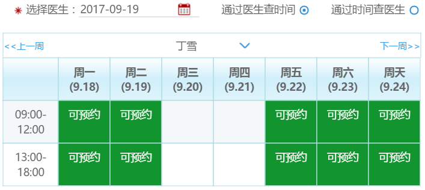
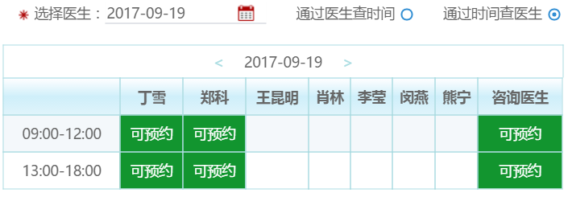

<h2>his系统医生排班表</h2>        
<div style="word-spacing: 10px;color: #337ab7;font-weight: bold">做诊所his系统后台时，主要需要实现根据医生选择预约时间和根据时间选择预约医生的功能，修改时需要时间和表格里的预约的医生和时间一致，表格的变动较多，略微有些复杂。实现效果如下：</div>


<h5>实现思路如下：</h5>
<ul>
        <li>先做好表格的样式，在做后台管理系统的过程中会用到较多的表格，我们可以使用bootstrap的表格来做，简单方便，需要修改的样式直接在bootstrap.css里做出修改即可</li>
        <li>填充选择医生的日期，利用ajax加载医生列表</li>
            <li>确定表格的横纵坐标,纵坐标都是时间段，根据医生查时间的横坐标是周一至周日，根据时间查医生的横坐标是医生姓名。<span style="color:red">（根据医生查时间点击上一周下一周，列表需要重新初始化，根据周一的日期和周天的日期获取数据来填充，实现过程见代码块）</span></li>

    <li>确定完了横纵坐标之后，遍历ajax的时间段等数据填充可以预约的表格</li>
    <li>预约，每次点击预约之后,状态样式改变，将所选中的医生的排班详细信息，存储起来。在下次点击预约的时候，重新存储相同的字段</li>
    <li>点击切换的时候，遍历本地缓存中是否有已经选过的医生排班，有的话直接展示</li>
</ul>     


### 代码块
``` python
var formatDate = function(date){       
    // var year = date.getFullYear()+'.';
    var month = (date.getMonth()+1)+'.';
    var day = date.getDate();
    var week = ['周天','周一','周二','周三','周四','周五','周六'][date.getDay()]; 
    return week+' '+'('+month+day+')';
};
var addDate= function(date,n){    
    date.setDate(date.getDate()+n);    
    return date;
};
var setDate = function(date){     
    // date.getDay() 获取本周的第几天
    var week = date.getDay()-1;
    date = addDate(date,week*-1);//获取本周的周一
    currentFirstDate = new Date(date);//当前日期
    // 循环添加横坐标，周一至周五
    for(var i = 1;i<clen;i++){         
      cells[i].innerHTML = formatDate(i==1 ? date : addDate(date,1));
    }        
};   
function GetDateStr(AddDayCount) { 
    var dd = new Date(); 
    var y = dd.getFullYear(); 
    var m = dd.getMonth()+1;//获取当前月份的日期 
    var d = dd.getDate(); 
    if(m<10){m='0'+m}
    if(d<10){d='0'+d}
    return y+"-"+m+"-"+d; 
} 
function GetDateStr2(day,AddDayCount) {
    var dd = new Date(day); 
    dd.setDate(dd.getDate()+AddDayCount);//获取AddDayCount天后的日期 
    var y = dd.getFullYear(); 
    var m = dd.getMonth()+1;//获取当前月份的日期 
    var d = dd.getDate(); 
    if(m<10){m='0'+m}
    if(d<10){d='0'+d}
    return y+"-"+m+"-"+d; 
} 
// 填充根据医生查时间的横坐标
var cells = document.getElementById('table1').getElementsByTagName('th');
var clen = cells.length;
var currentFirstDate;
setDate(new Date());  
var monday=new Date(currentFirstDate).format("yyyy-MM-dd");
var sunday0=addDate(currentFirstDate,6);
var sunday=new Date(sunday0).format("yyyy-MM-dd");
```
